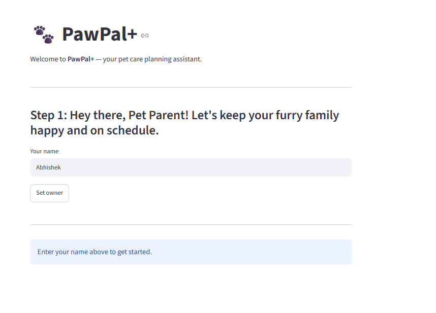
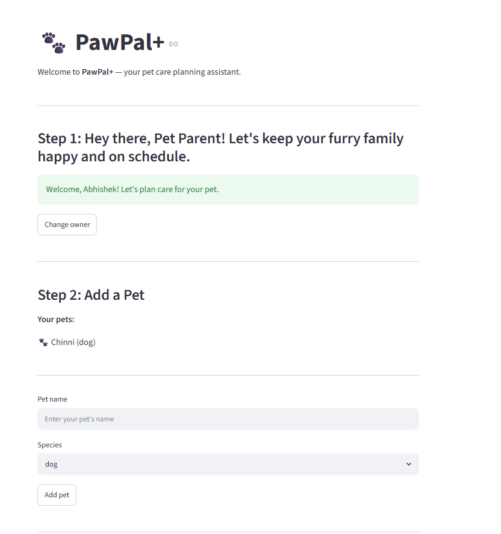
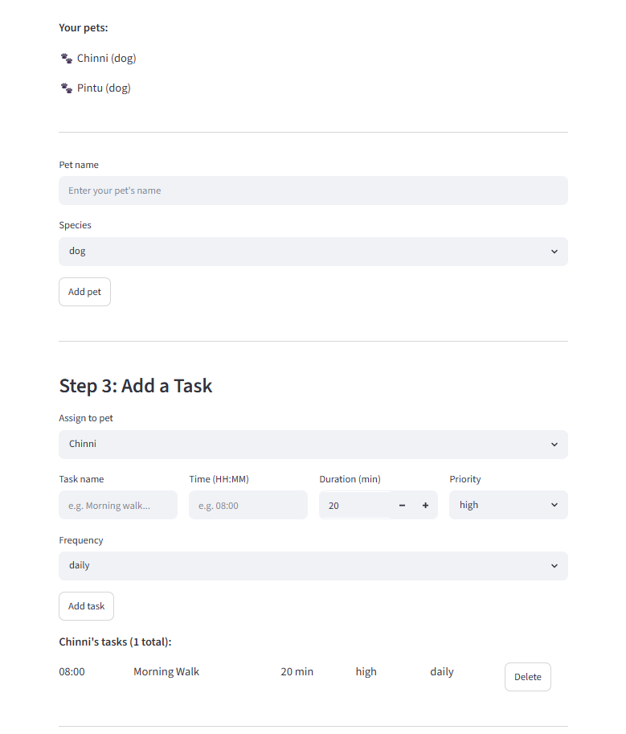
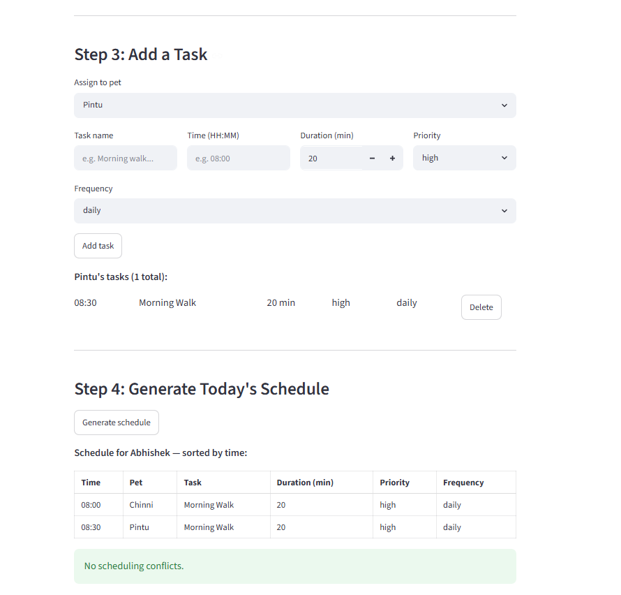
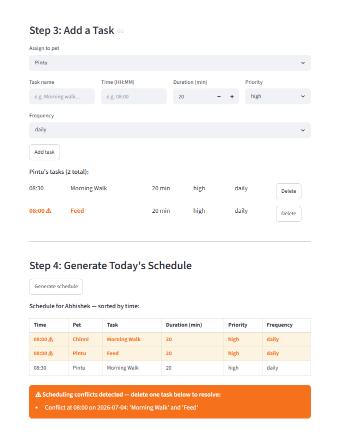
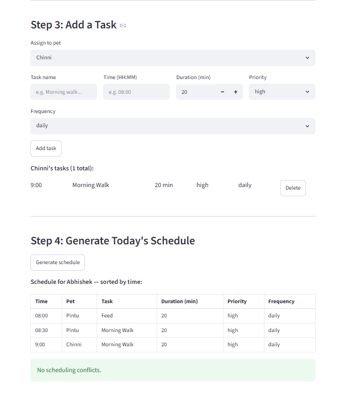

# PawPal+ — Pet Care Scheduling Assistant

**PawPal+** is a Streamlit app that helps a pet owner stay consistent with daily pet care. Enter your name, add your pets, schedule tasks, and get a conflict-checked daily plan — all in one place.

---

## What it does

- **Owner setup** — Enter your name once; the app locks it in and greets you by name for the rest of the session.
- **Multi-pet support** — Add as many pets as you like (dogs, cats, or other). Each pet has its own task list.
- **Task scheduling** — Add tasks with a name, time (HH:MM), duration, priority, and frequency (once / daily / weekly). Duplicate tasks at the same time are blocked automatically.
- **Delete tasks** — Remove any task directly from the task list — useful when you need to resolve a scheduling conflict.
- **Conflict detection** — Tasks that share the same time slot are flagged in **orange** in both the task list and the generated schedule, so you can spot and fix clashes at a glance.
- **Recurring tasks** — Daily and weekly tasks automatically generate the next occurrence when marked complete.
- **Sorted schedule** — One click generates a full cross-pet schedule sorted chronologically.

---

## Getting started

```bash
python -m venv .venv
.venv\Scripts\activate        # Windows
pip install -r requirements.txt
streamlit run app.py          # open http://localhost:8501
```

To run the CLI demo (no browser needed):

```bash
python main.py
```

---

## 🧪 Testing

Run the full test suite from the project root:

```bash
python -m pytest tests/test_pawpal.py -v
```

**What the tests cover:**
- **Sorting correctness** — tasks return in chronological HH:MM order
- **Conflict detection** — duplicate time slots are flagged with a warning
- **Recurrence logic** — daily/weekly tasks create the next occurrence after completion; `once` tasks do not
- **Filter by status** — only incomplete (or complete) tasks are returned
- **Filter by pet** — name matching is case-insensitive
- **Edge cases** — empty pet, already-completed task, no match on pet filter

```
============================= test session starts =============================
platform win32 -- Python 3.13.13, pytest-9.1.1, pluggy-1.6.0 -- .venv/Scripts/python.exe
collecting ... collected 14 items

tests/test_pawpal.py::test_task_mark_complete PASSED                     [  7%]
tests/test_pawpal.py::test_pet_task_count_increases_on_add PASSED        [ 14%]
tests/test_pawpal.py::test_sort_by_time_orders_chronologically PASSED    [ 21%]
tests/test_pawpal.py::test_sort_by_time_empty_pet PASSED                 [ 28%]
tests/test_pawpal.py::test_detect_conflicts_same_time_flags_warning PASSED [ 35%]
tests/test_pawpal.py::test_detect_conflicts_different_times_no_warning PASSED [ 42%]
tests/test_pawpal.py::test_handle_recurrence_daily_creates_next_day PASSED [ 50%]
tests/test_pawpal.py::test_handle_recurrence_weekly_creates_seven_days_later PASSED [ 57%]
tests/test_pawpal.py::test_handle_recurrence_once_does_not_add_task PASSED [ 64%]
tests/test_pawpal.py::test_filter_by_status_returns_only_incomplete PASSED [ 71%]
tests/test_pawpal.py::test_filter_by_pet_case_insensitive PASSED         [ 78%]
tests/test_pawpal.py::test_mark_complete_twice_stays_true PASSED         [ 85%]
tests/test_pawpal.py::test_handle_recurrence_not_complete_does_nothing PASSED [ 92%]
tests/test_pawpal.py::test_filter_by_pet_no_match_returns_empty PASSED   [100%]

============================== 14 passed in 0.06s ==============================
```

**Confidence level: ⭐⭐⭐⭐ (4/5)**
Core scheduling behaviors are fully tested. One star held back because conflict detection checks exact time matches only — overlapping durations (e.g. a 60-min task at 07:30 vs a task at 08:00) are not yet caught.

---

## 📐 Scheduling Features

| Feature | Method | Notes |
|---------|--------|-------|
| Sort by time | `Scheduler.sort_by_time()` | All tasks across all pets sorted chronologically by HH:MM string |
| Filter by status | `Scheduler.filter_by_status(completed)` | Returns only completed or only incomplete tasks |
| Filter by pet | `Scheduler.filter_by_pet(pet_name)` | Case-insensitive match on pet name |
| Conflict detection | `Scheduler.detect_conflicts()` | Flags tasks sharing the same scheduled_time + due_date; returns warning strings |
| Recurring tasks | `Scheduler.handle_recurrence(task, pet)` | Daily tasks advance 1 day; weekly tasks advance 7 days via `timedelta`; `once` tasks are not re-created |
| Delete a task | `Pet.remove_task(name, scheduled_time)` | Removes a task by name + time match; returns True if found. Primary way to resolve conflicts in the UI |
| Orange conflict highlight | UI — `app.py` | Conflicting task rows appear in orange bold text (with ⚠) in both the task list and the generated schedule |

---

## 📸 Demo Walkthrough

### Main UI features

**Step 1 — Set your name**
Enter your name and click **Set owner**. The field locks and the app greets you by name. Use **Change owner** to reset the full session.



---

**Step 2 — Add a pet**
Enter a pet name and species, then click **Add pet**. The form resets automatically — add as many pets as you like. All added pets appear above the form.



---

**Step 3 — Add tasks**
Select which pet to assign the task to, fill in the name, time (HH:MM), duration, priority, and frequency, then click **Add task**. Duplicate tasks at the same time are blocked automatically.





---

**Conflict highlight — live in the task list**
If any task shares a time slot with another task (across any pet), its row turns **orange bold with ⚠** immediately — no need to hit Generate first.



---

**Delete to resolve — then re-check**
Click **Delete** next to a conflicting task to remove it. The orange highlight clears instantly.



---

**Step 4 — Generate the schedule**
One click produces the full cross-pet schedule sorted by time. Conflicting rows are highlighted in orange in the schedule table too, with an orange banner prompting you to delete and resolve.


### Example workflow

**Add a pet → schedule tasks → spot a conflict → resolve it → view today's schedule**

1. Enter your name → **Set owner** (field locks, you're greeted by name)
2. Enter pet name "Pintu", species "dog" → **Add pet** (form resets, Pintu appears in the list)
3. Add task: `Morning Walk | 08:30 | 20 min | high | daily` → **Add task**
4. Add task: `Feed | 08:00 | 20 min | high | daily` → **Add task** (no conflict yet)
5. Add a second pet "Chinni" → add task: `Morning Walk | 08:00 | 20 min | high | daily`
6. Switch back to Pintu in the task selector — the `Feed` row turns **orange ⚠** (Chinni already has 08:00)
7. Click **Delete** next to the conflicting task to remove it
8. Click **Generate schedule** → all tasks sorted by time, no orange rows, no conflict banner

### Key Scheduler behaviors

- **Sorting** — `Scheduler.sort_by_time()` orders every task across all pets by HH:MM string, so the full day reads top-to-bottom in time order
- **Conflict warnings** — `Scheduler.detect_conflicts()` compares every task's `scheduled_time + due_date`; any two tasks sharing the same slot produce a warning string; the UI surfaces these as orange rows and an orange banner
- **Daily recurrence** — `Scheduler.handle_recurrence()` advances `due_date` by 1 day (daily) or 7 days (weekly) using `timedelta` when a task is marked complete; `once` tasks are never re-created
- **Filter by pet / status** — `filter_by_pet()` (case-insensitive) and `filter_by_status()` let the CLI demo slice the schedule without touching the data

### CLI output (run `python main.py`)

```
==================================================
  Today's Schedule for Jordan
  Date: 2026-07-04
==================================================
  [Mochi ]  [ ] 07:30 | Morning walk (30 min) [high] [daily]
  [Luna  ]  [ ] 08:00 | Feeding (10 min) [high] [daily]
  [Mochi ]  [ ] 09:00 | Flea medication (5 min) [medium] [weekly]
  [Luna  ]  [ ] 09:00 | Vet appointment (60 min) [high] [once]
  [Luna  ]  [ ] 11:00 | Grooming (20 min) [medium] [weekly]
  [Mochi ]  [ ] 18:00 | Evening walk (30 min) [high] [daily]

--- Conflict Check ---
  Conflicts detected:
  ! Conflict at 09:00 on 2026-07-04: 'Flea medication' and 'Vet appointment'

--- Recurring Task Demo ---
  Before: [ ] 07:30 | Morning walk (30 min) [high] [daily]
  Marking 'Morning walk' complete and scheduling next occurrence...
  After:  [x] 07:30 | Morning walk (30 min) [high] [daily]
  Next:   [ ] 07:30 | Morning walk (30 min) [high] [daily] (due: 2026-07-05)

--- Filter: Incomplete tasks only ---
  [Mochi ]  [ ] 18:00 | Evening walk (30 min) [high] [daily]
  [Mochi ]  [ ] 09:00 | Flea medication (5 min) [medium] [weekly]
  ...

--- Filter: Mochi's tasks only ---
  [Mochi ]  [x] 07:30 | Morning walk (30 min) [high] [daily]
  [Mochi ]  [ ] 18:00 | Evening walk (30 min) [high] [daily]
  ...
==================================================
```

---

## 🏗️ Architecture

Four Python classes in `pawpal_system.py`:

| Class | Role |
|-------|------|
| `Task` | Single care activity — name, time, duration, priority, frequency, completion status, due date |
| `Pet` | Owns a list of tasks; adds, counts, and removes tasks |
| `Owner` | Owns a list of pets; aggregates all tasks across pets |
| `Scheduler` | Sorts, filters, detects conflicts, and handles recurrence across all of an owner's tasks |

UML diagrams: [`diagrams/uml.mmd`](diagrams/uml.mmd) (initial design) and [`diagrams/uml_final.mmd`](diagrams/uml_final.mmd) (final implementation).
