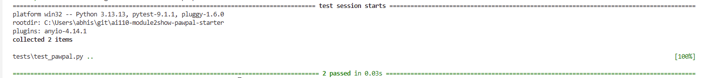

# PawPal+ (Module 2 Project)

You are building **PawPal+**, a Streamlit app that helps a pet owner plan care tasks for their pet.

## Scenario

A busy pet owner needs help staying consistent with pet care. They want an assistant that can:

- Track pet care tasks (walks, feeding, meds, enrichment, grooming, etc.)
- Consider constraints (time available, priority, owner preferences)
- Produce a daily plan and explain why it chose that plan

Your job is to design the system first (UML), then implement the logic in Python, then connect it to the Streamlit UI.

## What you will build

Your final app should:

- Let a user enter basic owner + pet info
- Let a user add/edit tasks (duration + priority at minimum)
- Generate a daily schedule/plan based on constraints and priorities
- Display the plan clearly (and ideally explain the reasoning)
- Include tests for the most important scheduling behaviors

## Getting started

### Setup

```bash
python -m venv .venv
source .venv/bin/activate  # Windows: .venv\Scripts\activate
pip install -r requirements.txt
```

### Suggested workflow

1. Read the scenario carefully and identify requirements and edge cases.
2. Draft a UML diagram (classes, attributes, methods, relationships).
3. Convert UML into Python class stubs (no logic yet).
4. Implement scheduling logic in small increments.
5. Add tests to verify key behaviors.
6. Connect your logic to the Streamlit UI in `app.py`.
7. Refine UML so it matches what you actually built.

## 🖥️ Sample Output

Run the CLI demo with: `python main.py`

```
=============================================
  Today's Schedule for Jordan
  Date: 2026-07-04
=============================================
  [Mochi]  [ ] 07:30 | Morning walk (30 min) [high] [daily]
  [Luna]   [ ] 08:00 | Feeding (10 min) [high] [daily]
  [Mochi]  [ ] 09:00 | Flea medication (5 min) [medium] [weekly]
  [Luna]   [ ] 11:00 | Grooming (20 min) [medium] [weekly]
  [Mochi]  [ ] 18:00 | Evening walk (30 min) [high] [daily]

No scheduling conflicts.
=============================================
```

## 🧪 Testing PawPal+

```bash
# Run the full test suite:
pytest

# Run with coverage:
pytest --cov
```


Sample test output:

```
============================= test session starts =============================
platform win32 -- Python 3.13.13, pytest-9.1.1, pluggy-1.6.0
collecting ... collected 2 items

tests/test_pawpal.py::test_task_mark_complete PASSED                     [ 50%]
tests/test_pawpal.py::test_pet_task_count_increases_on_add PASSED        [100%]

============================== 2 passed in 0.03s ==============================
```

## 📐 Smarter Scheduling

| Feature | Method(s) | Notes |
|---------|-----------|-------|
| Task sorting by time | `Scheduler.sort_by_time()` | Sorts all tasks across all pets chronologically using HH:MM string sort with a lambda key |
| Filter by status | `Scheduler.filter_by_status(completed)` | Returns only completed or only incomplete tasks across all pets |
| Filter by pet | `Scheduler.filter_by_pet(pet_name)` | Returns only tasks belonging to a specific named pet (case-insensitive) |
| Conflict detection | `Scheduler.detect_conflicts()` | Flags any two tasks sharing the exact same scheduled_time and due_date; returns warning strings rather than crashing |
| Recurring tasks | `Scheduler.handle_recurrence(task, pet)` | When a daily or weekly task is marked complete, automatically creates the next occurrence with due_date advanced by 1 or 7 days using `timedelta`; "once" tasks are not re-created |

## 📸 Demo Walkthrough

Describe your app in numbered steps so a reader can follow along without watching a video:

1. <!-- Describe this step -->
2. <!-- Describe this step -->
3. <!-- Describe this step -->
4. <!-- Describe this step -->
5. <!-- Add more steps as needed -->

**Screenshot or video** *(optional)*: <!-- Insert a screenshot or link to a demo video here -->
